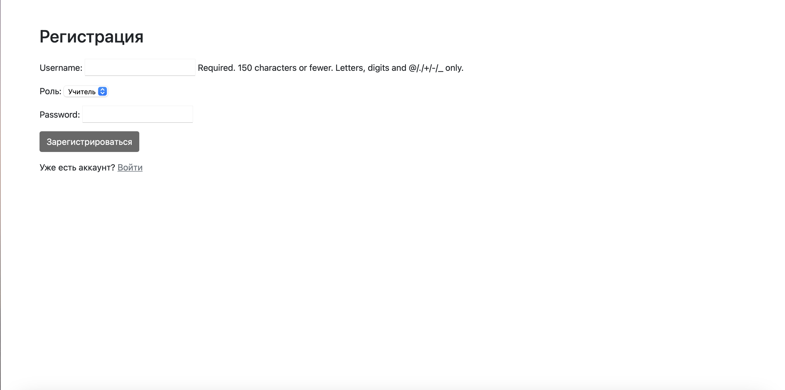
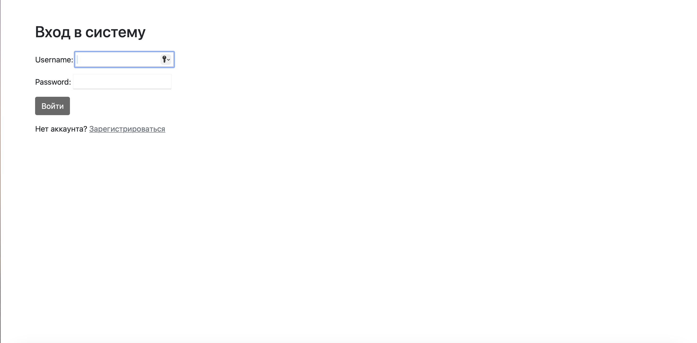
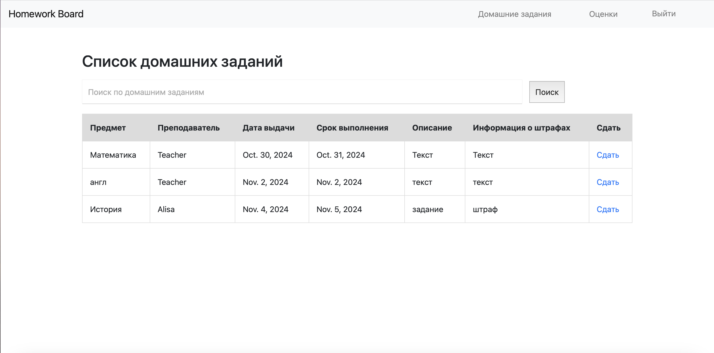
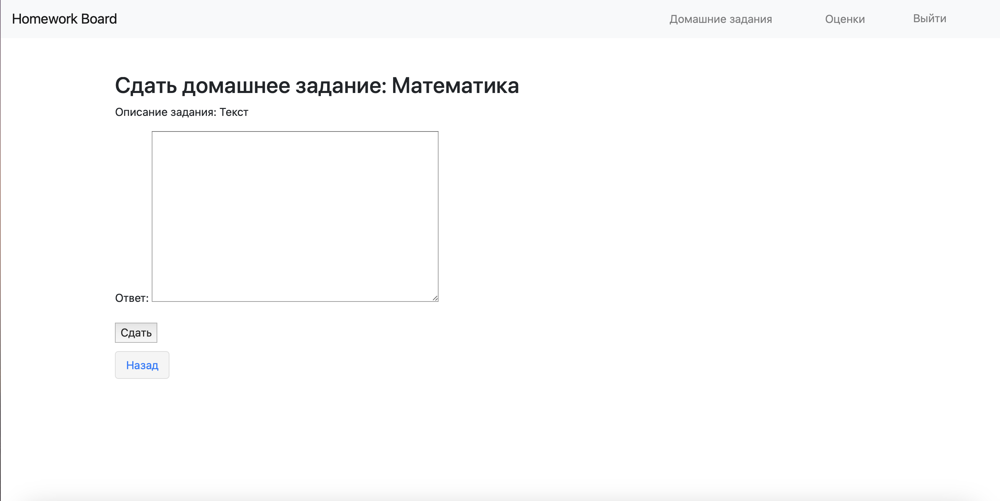
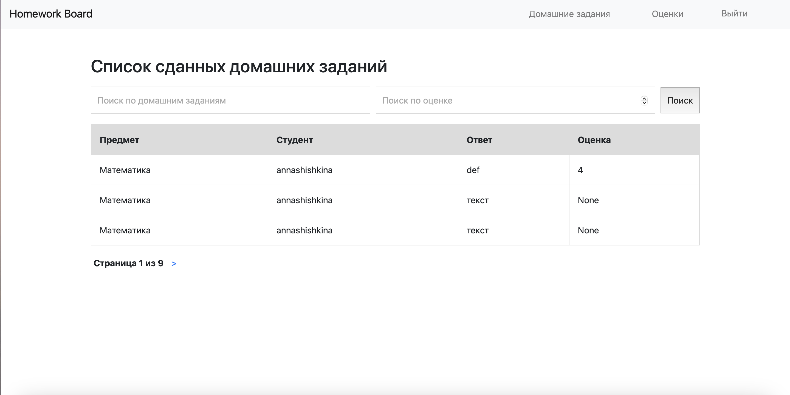

# Задание 1

Реализовать сайт используя фреймворк Django 3 и СУБД PostgreSQL *, в соответствии с вариантом задания лабораторной работы.

## Доска домашних заданий.  
- О домашнем задании должна храниться следующая информация: предмет, преподаватель, дата выдачи, период выполнения, текст задания, информация о штрафах.  
Необходимо реализовать следующий функционал:  
- Регистрация новых пользователей.  
- Просмотр домашних заданий по всем дисциплинам (сроки выполнения, описание задания).  
- Сдача домашних заданий в текстовом виде.  
- Администратор (учитель) должен иметь возможность поставить оценку за задание средствами Django-admin. 
- В клиентской части должна формироваться таблица, отображающая оценки всех учеников класса.  

- Язык реализации: Python

## Возможности сайта 
- Регистрация:  
<http://127.0.0.1:8000/register/>  
Поля: username, роль ('Учитель','Ученик'), password.

```python
def register(request):
    if request.method == 'POST':
        form = RegistrationForm(request.POST)
        if form.is_valid():
            form.save()
            return redirect('login')
    else:
        form = RegistrationForm()
    return render(request, 'register.html', {'form': form})
```

- Вход в доску домашних заданий:
<http://127.0.0.1:8000/login/>  
По полям username и password.

```python
auth_views.LoginView.as_view(template_name='login.html')
```

### Функции, доступные ученикам
- Просмотр домашних заданий:    
<http://127.0.0.1:8000/homeworks/>  
Отображение ввиде таблицы с полями: предмет, преподаватель, дата выдачи, срок выполнения, описание (текст задания), информация о штрафах.

```python
def homework_list(request):
    query = request.GET.get('search', '')
    homeworks = Homework.objects.all()
    if query:
        homeworks = homeworks.filter(
            subject__icontains=query
        ) | homeworks.filter(
            description__icontains=query
        ) | homeworks.filter(
            teacher__username__icontains=query
        )

    return render(request, 'homework_list.html', {'homeworks': homeworks})
```

- Сдача домашней работы:
<http://127.0.0.1:8000/submit_hw/hw_id/>, где hw_id подставляется автоматически и показывает, какую конкретную домашку хочет сдать ученик.

```python
def submit_hw(request, hw_id):
    if is_teacher(request.user):
        return wrong_role_view(request)

    if is_student(request.user):
        hw = Homework.objects.get(pk=hw_id)

        if request.method == 'POST':
            form = SubmissionForm(request.POST)
            if form.is_valid():
                submission = form.save(commit=False)
                submission.hw = hw
                submission.student = request.user
                submission.save()
                return success_view(request)
        else:
            form = SubmissionForm()

        return render(request, 'submit_hw.html', {'form': form, 'hw': hw})
```

- Просмотр сданных домашних заданий:
<http://127.0.0.1:8000/submissions/> 
Отображение ввиде таблицы с полями: предмет, студент, ответ, оценка. Притом студенту доступны только его оценки.

```python
def submissions_list(request):
    current_user = request.user

    query = request.GET.get('search', '')
    grade_query = request.GET.get('grade', '')

    submissions = Submission.objects.filter(student=current_user)

    if query:
        submissions = submissions.filter(
            hw__subject__icontains=query
        ) | submissions.filter(
            submission_text__icontains=query
        )

    if grade_query:
        try:
            grade = int(grade_query)
            submissions = submissions.filter(grade=grade)
        except ValueError:
            pass

    paginator = Paginator(submissions, 3)
    page_number = request.GET.get('page')
    page_obj = paginator.get_page(page_number)

    return render(request, 'submissions_list.html', {'page_obj': page_obj, 'request': request})
```

### Функции, доступные учителям
- Просмотр домашних заданий
- Просмотр сданных домашних заданий
- Выставление оценок через админку
- Написание нового домашнего задания через админку

## Запуск сайта
```python
python manage.py runserver
```
