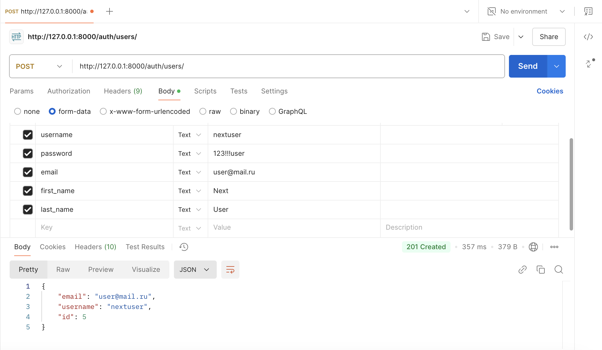
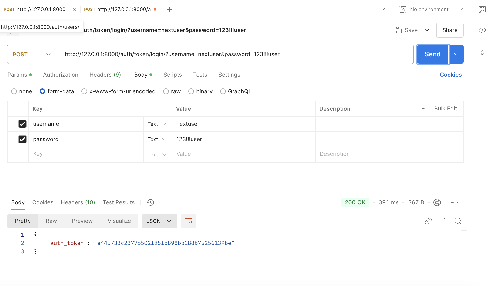

# Задание

Реализация серверной части приложения средствами django и djangorestframework в соответствии с заданием

## Практическая работа 3.1
- Запрос на создание 6-7 новых автовладельцев и 5-6 автомобилей
```python
owners = [
Owner.objects.create(last_name="Иванов", first_name="Иван", date_of_birth="1985-06-15"),
Owner.objects.create(last_name="Петров", first_name="Петр", date_of_birth="1990-09-20"),
Owner.objects.create(last_name="Шишкина", first_name="Анна", date_of_birth="2004-09-07"),
Owner.objects.create(last_name="Кузнецов", first_name="Илья", date_of_birth="1978-04-10"),
Owner.objects.create(last_name="Смирнов", first_name="Сергей", date_of_birth="1995-02-18"),
Owner.objects.create(last_name="Федоров", first_name="Федор", date_of_birth="1988-07-30"),
]
cars = [
Car.objects.create(car_number="777", brand="Toyota", car_model="Camry", colour="Белый"),
Car.objects.create(car_number="222", brand="Hyundai", car_model="Solaris", colour="Черный"),
Car.objects.create(car_number="111", brand="Kia", car_model="Rio", colour="Белый"),
Car.objects.create(car_number="555", brand="BMW", car_model="X5", colour="Серый"),
Car.objects.create(car_number="111", brand="Mercedes", car_model="E-Class", colour="Красный"),
]
```
- Каждому автовладельцу назначьте удостоверение 
```python
for owner in owners:
	License.objects.create(
	owner=owner,
	license_number="123",
	license_type="B",
	receiving_date=date(2015, 5, 20)
	)
```
- и от 1 до 3 автомобилей
```python
Ownership.objects.create(owner=owners[0], car=cars[0], beginning="2020-01-01", ending="2024-01-01")
Ownership.objects.create(owner=owners[0], car=cars[1], beginning="2021-03-01")
Ownership.objects.create(owner=owners[1], car=cars[2], beginning="2019-05-15", ending="2023-12-31")
Ownership.objects.create(owner=owners[2], car=cars[3], beginning="2022-06-01")
Ownership.objects.create(owner=owners[2], car=cars[4], beginning="2023-07-15")
Ownership.objects.create(owner=owners[3], car=cars[0], beginning="2018-08-01", ending="2022-08-01")
Ownership.objects.create(owner=owners[3], car=cars[2], beginning="2023-09-01")
Ownership.objects.create(owner=owners[4], car=cars[1], beginning="2021-11-01")
Ownership.objects.create(owner=owners[4], car=cars[4], beginning="2022-12-01")
Ownership.objects.create(owner=owners[5], car=cars[3], beginning="2020-10-01")
```
### Запросы:
-   Выведете все машины марки “Toyota” (или любой другой марки, которая у вас есть)
```python
Car.objects.filter(brand="Toyota")
<QuerySet [<Car: Toyota Camry (777)>]> 
```
- Найти всех водителей с именем “Олег” (или любым другим именем на ваше усмотрение)
```python
>>> Owner.objects.filter(first_name="Анна")
<QuerySet [<Owner: Шишкина Анна>]>
```
- Взяв любого случайного владельца получить его id, и по этому id получить экземпляр удостоверения в виде объекта модели (можно в 2 запроса)
```python
>>> import random
>>> owner_id = random.choice(Owner.objects.all()).id
>>> License.objects.get(owner_id=owner_id)
<License: Удостоверение 123 (B) - Иванов Иван>
>>>
```
- Вывести всех владельцев красных машин (или любого другого цвета, который у вас присутствует)
```python
>>>Owner.objects.filter(ownership__car__colour="Белый").distinct()
<QuerySet [<Owner: Иванов Иван>, <Owner: Петров Петр>, <Owner: Кузнецов Илья>]>
```
- Найти всех владельцев, чей [год владения машиной](https://docs.djangoproject.com/en/3.2/ref/models/querysets/#year) начинается с 2010 (или любой другой год, который присутствует у вас в базе)
```python
>>>Owner.objects.filter(ownership__beginning__year=2021).distinct()
<QuerySet [<Owner: Иванов Иван>, <Owner: Смирнов Сергей>]>
```
- Вывод даты выдачи самого старшего водительского удостоверения
```python
>>> from django.db.models import Min
>>> License.objects.aggregate(Min('receiving_date'))
{'receiving_date__min': datetime.date(2015, 5, 20)}
```
- Укажите самую позднюю дату владения машиной, имеющую какую-то из существующих моделей в вашей базе
```python
>>> Ownership.objects.aggregate(Max('ending'))
{'ending__max': datetime.date(2024, 10, 5)}
```
- Выведите количество машин для каждого водителя
```python
>>> Owner.objects.values('first_name', 'last_name').annotate(Count('ownership__car'))
<QuerySet [{'first_name': 'Анна', 'last_name': 'Шишкина', 'ownership__car__count': 2}, {'first_name': 'Иван', 'last_name': 'Иванов', 'ownership__car__count': 2}, {'first_name': 'Илья', 'last_name': 'Кузнецов', 'ownership__car__count': 2}, {'first_name': 'Петр', 'last_name': 'Петров', 'ownership__car__count': 1}, {'first_name': 'Сергей', 'last_name': 'Смирнов', 'ownership__car__count': 2}, {'first_name': 'Федор', 'last_name': 'Федоров', 'ownership__car__count': 1}]>
```
- Подсчитайте количество машин каждой марки
```python
>>> Car.objects.values('brand').annotate(Count('id'))
<QuerySet [{'brand': 'BMW', 'id__count': 1}, {'brand': 'Hyundai', 'id__count': 1}, {'brand': 'Kia', 'id__count': 1}, {'brand': 'Mercedes', 'id__count': 1}, {'brand': 'Toyota', 'id__count': 1}]>
```
- Отсортируйте всех автовладельцев по дате выдачи удостоверения
```python
>>>Owner.objects.distinct().order_by('license__receiving_date')
<QuerySet [<Owner: Иванов Иван>, <Owner: Петров Петр>, <Owner: Шишкина Анна>, <Owner: Кузнецов Илья>, <Owner: Смирнов Сергей>, <Owner: Федоров Федор>]>
```
## Практическая работа 3.2
### Реализовать ендпоинты для добавления и просмотра скилов методом, описанным в пункте выше.

- Добавление скилов

POST <http://127.0.0.1:8000/war/skills/create/>
```javascript
{
    "title": "write"
}
```

```javascript
{
    "Success": "Skill 'write' created successfully."
}
```

- Просмотр скилов

GET <http://127.0.0.1:8000/war/warriors/>
```javascript
{
    "Skills": [
        {
            "id": 1,
            "title": "read"
        }
    ]
}
```
- Вывод полной информации о всех войнах и их профессиях (в одном запросе).
GET <http://127.0.0.1:8000//war/warriors/professions/>
```javascript
[
    {
        "id": 4,
        "race": "d",
        "name": "Updated Warrior Name",
        "level": 5,
        "profession": {
            "id": 3,
            "title": "студент",
            "description": "обучается в университете"
        }
    }
]
```

- Вывод полной информации о всех войнах и их скилах (в одном запросе).
GET <http://127.0.0.1:8000//war/warriors/skills/>
```javascript
[
    {
        "id": 4,
        "race": "d",
        "name": "Updated Warrior Name",
        "level": 5,
        "skill": []
    }
]
```

- Вывод полной информации о войне (по id), его профессиях и скилах.
GET <http://127.0.0.1:8000/war/warrior/<int:pk>/>
```javascript
{
    "id": 4,
    "race": "d",
    "name": "Updated Warrior Name",
    "level": 5,
    "profession": {
        "id": 3,
        "title": "студент",
        "description": "обучается в университете"
    },
    "skill": []
}
```
- Удаление война по id.
DELETE <http://127.0.0.1:8000/war/warrior/<int:pk>/delete>
```javascript
{
    "success": "Warrior deleted successfully"
}
```
- Редактирование информации о войне.
PUT <http://127.0.0.1:8000/war/warrior/<int:pk>/update>
```javascript
{
    "level": 10
}
```
```javascript
{
    "success": "Warrior updated successfully",
    "data": {
        "name": "Alex",
        "level": 10,
        "race": "s",
        "profession": 3
    }
}
```
## Вариант №3

### Эндпоинты:

1) Просмотр списка учителей
GET <http://127.0.0.1:8000/school/teachers/> 
```javascript
{
    "Teachers": [
        {
            "first_name": "Иван",
            "last_name": "Петров",
            "subject": [
                1
            ],
            "leaded_class": null,
            "cabinet": null
        },
        {
            "first_name": "Алексей",
            "last_name": "Казаков",
            "subject": [
                2
            ],
            "leaded_class": null,
            "cabinet": null
        },
        {
            "first_name": "Иван",
            "last_name": "Иванов",
            "subject": [],
            "leaded_class": 1,
            "cabinet": 1
        },
        {
            "first_name": "Петр",
            "last_name": "Петров",
            "subject": [
                2
            ],
            "leaded_class": 1,
            "cabinet": 1
        },
        {
            "first_name": "Иван",
            "last_name": "Иванов",
            "subject": [],
            "leaded_class": 1,
            "cabinet": 1
        },
        {
            "first_name": "Петр",
            "last_name": "Петров",
            "subject": [],
            "leaded_class": 1,
            "cabinet": 2
        },
        {
            "first_name": "Петр",
            "last_name": "Петров",
            "subject": [],
            "leaded_class": 1,
            "cabinet": 2
        },
        {
            "first_name": "Петр",
            "last_name": "Петров",
            "subject": [],
            "leaded_class": 1,
            "cabinet": 3
        },
        {
            "first_name": "Петр",
            "last_name": "Шишкин",
            "subject": [],
            "leaded_class": 1,
            "cabinet": 2
        },
        {
            "first_name": "Петр",
            "last_name": "Шишкин",
            "subject": [],
            "leaded_class": 1,
            "cabinet": 2
        }
    ]
}
```

2) Просмотр списка учеников
GET <http://127.0.0.1:8000/school/students/> 
```javascript
[
    {
        "first_name": "Алина",
        "last_name": "Шишкина",
        "gender": "f",
        "school_classes": [
            1
        ],
        "grades": [
            1,
            2
        ]
    }
]
```

3) Добавление нового учителя
POST <http://127.0.0.1:8000/school/add_teacher/>
```javascript
{
    "first_name": "Anna",
    "last_name": "Shishkina",
    "subject": 1,
    "leaded_class": 1,
    "cabinet": 3
}
```

```javascript
{
    "first_name": "Anna",
    "last_name": "Shishkina",
    "subject": [],
    "leaded_class": 1,
    "cabinet": 3
}
```

4) Добавление нового ученика

POST <http://127.0.0.1:8000/school/add_student/>
```javascript
{
    "gender": "m",
    "first_name": "Petr",
    "last_name": "Petrov"
}
```

```javascript
{
    "first_name": "Petr",
    "last_name": "Petrov",
    "gender": "m",
    "school_classes": [],
    "grades": []
}
```

5) Добавление новой оценки
POST <http://127.0.0.1:8000/school/add_grades/>
```javascript
{
    "student": 4,
    "subject": 1,
    "year": "2023",
    "quarter": 4,
    "grade": 5
}
```
```javascript
[
    {
        "student": 4,
        "subject": 1,
        "year": 2023,
        "quarter": 4,
        "grade": 5
    }
]
```

6) Удаление уволившегося учителя
DELETE <http://127.0.0.1:8000/school/delete_teacher/2/>

```javascript
{
    "message": "Учитель с ID 2 успешно удалён."
}
```

7) Удаление отчисленного ученика
DELETE <http://127.0.0.1:8000/school/delete_student/5/>

```javascript
{
    "message": "Ученик с ID 5 успешно удалён."
}
```

8) Обновление данных об учителе 
PUT <http://127.0.0.1:8000/school/update_teacher/5/>

```javascript
{
    "cabinet": 2
}
```
```javascript
{
    "first_name": "Алексей",
    "last_name": "Казаков",
    "subject": [
        2
    ],
    "leaded_class": null,
    "cabinet": 2
}
```

9) Обновление данных об ученике
PUT <http://127.0.0.1:8000/school/update_student/9/>

```javascript
{
    "first_name": "Sasha"
}
```
```javascript
{
    "first_name": "Sasha",
    "last_name": "Шишкина",
    "gender": "f",
    "school_classes": [
        1
    ],
    "grades": [
        1,
        2,
        1
    ]
}
```

10) Обновление четвертной оценки
PUT <http://127.0.0.1:8000/school/update_grade/9/>

```javascript
{
    "garde": 4
}
```
```javascript
{
    "student": 4,
    "subject": 1,
    "year": 2024,
    "quarter": 4,
    "grade": 4
}
```

11) Добавление урока в расписание

12) Обновление данных о занятии
PUT <http://127.0.0.1:8000/school/schedule/3/>

```javascript
{
    "time": "15:00:00"
}
```
```javascript
{
    "teacher": "Алексей Казаков",
    "subject": "история",
    "classroom": "Кабинет 100 - Профильный",
    "time": "15:00:00"
}
```

13) Удаление занятия из расписания
DELETE <http://127.0.0.1:8000/school/schedule/3/>

```javascript
{
    "detail": "Запись в расписании успешно удалена."
}
```

14) Получение отчёта об успеваемости класса
GET <http://127.0.0.1:8000/school/class-report/0/>

```javascript
{
    "name": "10А",
    "class_teacher": "Алексей Казаков",
    "subject_grades": {
        "математика": 4.5,
        "история": 5.0
    },
    "average_class_grade": 4.666666666666667,
    "total_students": 1
}
```

15) Нахождение количества учителей для каждого предмета
GET <http://127.0.0.1:8000/school/teachers-per-subject/>

```javascript
[
    {
        "title": "математика",
        "num_teachers": 0
    },
    {
        "title": "история",
        "num_teachers": 2
    }
]
```

16) Нахождение количества учеников в классе
GET <http://127.0.0.1:8000/school/students-per-class/10А/f/ >

```javascript
{
    "class": "10А",
    "gender": "Женский",
    "students_count": 1
}
```

17) Нахожденеи количества профильных/непрофильных классов

GET <http://127.0.0.1:8000/school/classrooms/profile/>
```javascript
{
    "classroom_type": "Профильные",
    "count": 4
}
```
GET <http://127.0.0.1:8000/school/classrooms/basic/>
```javascript
{
    "classroom_type": "Непрофильные",
    "count": 1
}
```

18) Какой предмет будет в заданном классе, в заданный день недели на заданном уроке
GET <http://127.0.0.1:8000/school/schedule/10А/ср/15:00:00/>
```javascript
[
    {
        "teacher": "Иван Иванов",
        "subject": "история",
        "classroom": "Кабинет 101 - Профильный",
        "time": "15:00:00"
    }
]
```

### Проверка djoser



## Модели данных:
```python
class Teacher(models.Model):
    """
    Описание учителя
    """
    first_name = models.CharField(max_length=120, verbose_name='Имя')
    last_name = models.CharField(max_length=120, verbose_name='Фамилия')
    subject = models.ManyToManyField('Subject', through='TeacherSubject', verbose_name='Предметы')
    leaded_class = models.ForeignKey(
        'Class', 
        on_delete=models.SET_NULL, 
        null=True, 
        blank=True, 
        verbose_name='Классный руководитель',
        related_name='led_by_teacher',
        limit_choices_to={'lead_teacher__isnull': False}
    )
    cabinet = models.ForeignKey('Classroom', on_delete=models.SET_NULL, null=True, blank=True, verbose_name='Закрепленный кабинет')

    def __str__(self):
        return f"{self.first_name} {self.last_name}"


class Subject(models.Model):
    """
    Описание предмета
    """
    title = models.CharField(max_length=120, verbose_name='Наименование предмета')

    def __str__(self):
        return self.title


class TeacherSubject(models.Model):
    """
    Описание предметов, которые преподавал учитель в определенный период
    """
    teacher = models.ForeignKey('Teacher', on_delete=models.CASCADE, verbose_name='Учитель')
    subject = models.ForeignKey('Subject', on_delete=models.CASCADE, verbose_name='Предмет')
    start_date = models.DateField(verbose_name='Дата начала преподавания')
    end_date = models.DateField(verbose_name='Дата окончания преподавания')


class Class(models.Model):
    """
    Описание класса
    """
    name = models.CharField(max_length=50, verbose_name='Класс')
    lead_teacher = models.ForeignKey(
        'Teacher',
        on_delete=models.SET_NULL,
        null=True,
        blank=True,
        related_name='classes',
        verbose_name='Классный руководитель'
    )

    def __str__(self):
        return self.name


class Student(models.Model):
    """
    Описание ученика
    """
    gender_types = (
        ('m', 'Мужской'),
        ('f', 'Женский'),
    )
    gender = models.CharField(max_length=1, choices=gender_types, verbose_name='Пол')
    first_name = models.CharField(max_length=120, verbose_name='Имя')
    last_name = models.CharField(max_length=120, verbose_name='Фамилия')
    school_classes = models.ManyToManyField('Class', through='StudentClass', verbose_name='Классы')
    grades = models.ManyToManyField('Subject', through='Grade', verbose_name='Оценки')

    def __str__(self):
        return f"{self.first_name} {self.last_name}"


class StudentClass(models.Model):
    """
    Ассоциация между учеником и классом с периодом обучения
    """
    student = models.ForeignKey('Student', on_delete=models.CASCADE, verbose_name='Ученик')
    school_class = models.ForeignKey('Class', on_delete=models.CASCADE, verbose_name='Класс')
    start_date = models.DateField(verbose_name='Дата начала обучения')
    end_date = models.DateField(verbose_name='Дата окончания обучения')

    def __str__(self):
        return f"{self.student} - {self.school_class} ({self.start_date} - {self.end_date})"


class Grade(models.Model):
    """
    Описание оценок ученика
    """
    student = models.ForeignKey('Student', on_delete=models.CASCADE, verbose_name='Ученик')
    subject = models.ForeignKey('Subject', on_delete=models.CASCADE, verbose_name='Предмет')
    year = models.IntegerField(verbose_name='Учебный год')
    quarter = models.IntegerField(verbose_name='Четверть')
    grade = models.IntegerField(verbose_name='Оценка')

    def __str__(self):
        return f"{self.student} - {self.subject.title} - {self.year} - Четверть {self.quarter} - {self.grade}"


class Classroom(models.Model):
    """
    Описание кабинета
    """
    number = models.CharField(max_length=10, verbose_name='Номер кабинета')
    is_profile = models.BooleanField(default=False, verbose_name='Профильный кабинет')

    def __str__(self):
        profile_status = "Профильный" if self.is_profile else "Непрофильный"
        return f"Кабинет {self.number} - {profile_status}"


class Schedule(models.Model):
    """
    Описание расписания занятий
    """
    teacher = models.ForeignKey('Teacher', on_delete=models.CASCADE, verbose_name='Учитель')
    subject = models.ForeignKey('Subject', on_delete=models.CASCADE, verbose_name='Предмет')
    class_group = models.ForeignKey('Class', on_delete=models.CASCADE, verbose_name='Класс')
    classroom = models.ForeignKey('Classroom', on_delete=models.SET_NULL, null=True, blank=True, verbose_name='Кабинет')
    day_of_week = models.CharField(max_length=50, verbose_name='День недели')
    time = models.TimeField(verbose_name='Время занятия')

    def __str__(self):
        classroom_info = f"Кабинет {self.classroom}" if self.classroom else "Кабинет не назначен"
        return f"{self.teacher} - {self.subject.title} - {self.class_group} - {classroom_info} - {self.day_of_week} - {self.time}"
```

## Используемые сериалайзеры:
```python
class TeacherSerializer(serializers.ModelSerializer):
    class Meta:
        model = Teacher
        fields = ['first_name', 'last_name', 'subject', 'leaded_class', 'cabinet']


class GradeSerializer(serializers.ModelSerializer):
    class Meta:
        model = Grade
        fields = ['student', 'subject', 'year', 'quarter', 'grade']


class ScheduleSerializer(serializers.ModelSerializer):
    teacher = serializers.StringRelatedField() 
    subject = serializers.StringRelatedField()
    classroom = serializers.StringRelatedField() 

    class Meta:
        model = Schedule
        fields = ['teacher', 'subject', 'classroom', 'time']


class ClassReportSerializer(serializers.ModelSerializer):
    class_teacher = serializers.CharField(source='lead_teacher.__str__', read_only=True)
    subject_grades = serializers.SerializerMethodField()
    average_class_grade = serializers.SerializerMethodField()
    total_students = serializers.SerializerMethodField()

    class Meta:
        model = Class
        fields = ['name', 'class_teacher', 'subject_grades', 'average_class_grade', 'total_students']

    def get_subject_grades(self, obj):
        grades = Grade.objects.filter(student__school_classes=obj)
        subject_avg = {}
        
        for grade in grades:
            if grade.subject.title not in subject_avg:
                subject_avg[grade.subject.title] = []
            subject_avg[grade.subject.title].append(grade.grade)
        
        subject_averages = {subject: sum(grades_list) / len(grades_list) for subject, grades_list in subject_avg.items()}
        
        return subject_averages

    def get_average_class_grade(self, obj):
        grades = Grade.objects.filter(student__school_classes=obj)
        total_grade = sum([grade.grade for grade in grades])
        total_count = len(grades)
        
        if total_count == 0:
            return 0 
        
        return total_grade / total_count

    def get_total_students(self, obj):
        return Student.objects.filter(school_classes=obj).count()


class ClassSerializer(serializers.ModelSerializer):
    class Meta:
        model = Class
        fields = ['id', 'name', 'lead_teacher']


class GradeSerializer(serializers.ModelSerializer):
    subject = serializers.StringRelatedField()

    class Meta:
        model = Grade
        fields = ['id', 'subject', 'year', 'quarter', 'grade']


class StudentSerializer(serializers.ModelSerializer):
    school_classes = ClassSerializer(many=True, source='school_classes.all')
    grades = GradeSerializer(many=True, source='grade_set.all')

    class Meta:
        model = Student
        fields = ['id', 'first_name', 'last_name', 'gender', 'school_classes', 'grades']
```


## Запуск сайта
```python
python manage.py runserver
```
